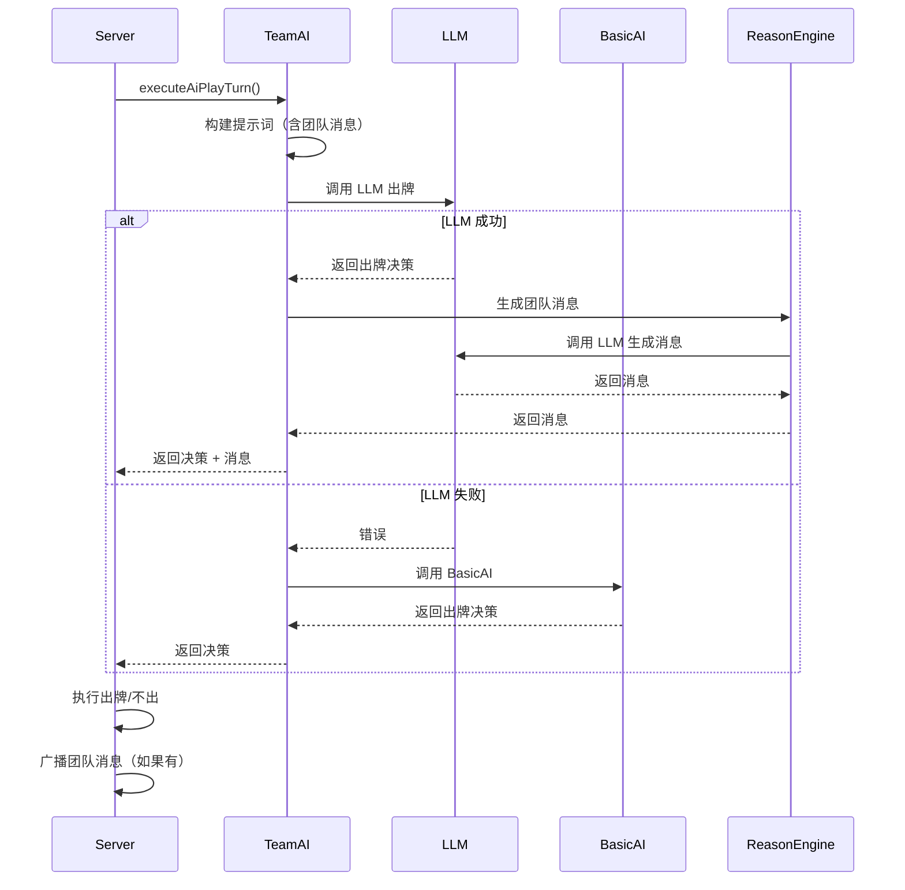
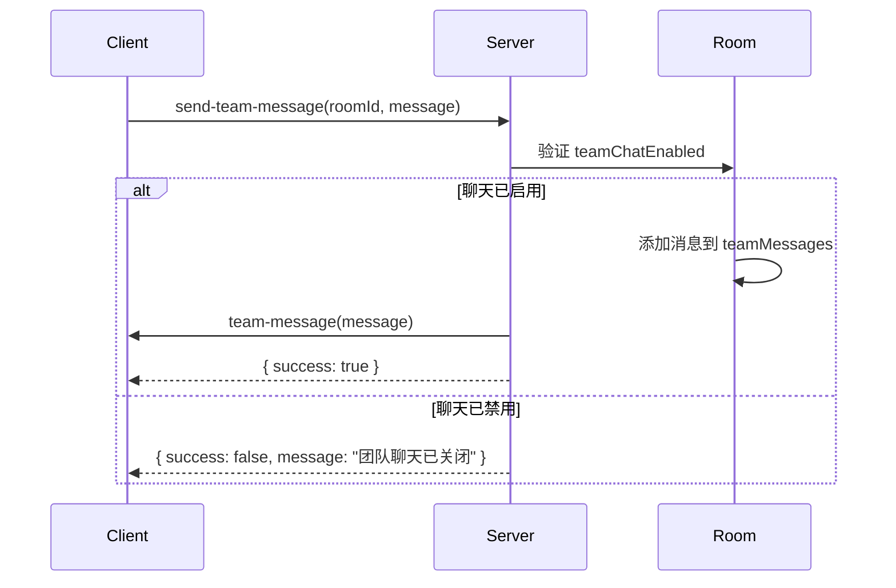

# 掼蛋教练 V2 概要设计（HLD）

## 1. 文档目标
基于 PRD 第二个里程碑（V2：AI LLM 出牌 + 团队聊天），给出可直接进入研发拆解的概要设计，覆盖：
- 系统边界与架构分层
- 模块职责
- 核心时序与数据模型
- 接口协议（Socket）
- 关键流程与兜底策略
- 非功能要求与测试策略

## 2. 范围与边界
### 2.1 In Scope（V2）
1. AI 对手优先使用 LLM 出牌，失败回退到 BasicAI。
2. 团队聊天系统：
   - 玩家发送团队消息。
   - AI 自动生成提示消息。
   - 消息全场可见。
3. 团队消息融入 AI 决策过程。
4. 聊天开关控制（默认开启）。

### 2.2 Out of Scope（不在 V2）
1. 复盘回溯（V3）。
2. 私聊功能。
3. 话术教练、身份识别策略（后续扩展）。

## 3. 总体架构
```mermaid
flowchart LR
  subgraph client [Client(Vue3)]
    gameView[GameView]
    gameBoard[GameBoard/HandCards]
    socketClient[useSocket]
    coachPanel[CoachHintPanel]
    teamChatPanel[TeamChatPanel]
  end

  subgraph server [Server(Node+Socket.io)]
    socketHandler[SocketEventHandler]
    gameEngine[GuandanGame]
    coachService[CoachHintService]
    teamAI[TeamAI]
    basicAI[BasicAI]
    reasonEngine[ReasonEngine]
    llmAdapter[LLMAdapter]
  end

  gameView --> gameBoard
  gameBoard --> coachPanel
  gameBoard --> teamChatPanel
  teamChatPanel --> socketClient
  coachPanel --> socketClient
  socketClient --> socketHandler
  socketHandler --> gameEngine
  socketHandler --> coachService
  socketHandler --> teamAI
  teamAI --> basicAI
  teamAI --> reasonEngine
  coachService --> basicAI
  coachService --> reasonEngine
  reasonEngine --> llmAdapter
```

## 4. 模块设计
### 4.1 Client 模块
1. `TeamChatPanel`（新增）
   - 职责：消息展示、消息输入、发送按钮。
   - 输入：团队消息列表、`teamChatEnabled` 状态。
   - 输出：触发 `send-team-message`。

2. `useSocket`（扩展）
   - 新增订阅：`team-message`、`team-chat-toggled`。
   - 新增发送：`send-team-message`、`toggle-team-chat`。

3. `game store`（扩展）
   - 新增 `teamMessages[]`：团队消息列表。
   - 新增 `teamChatEnabled`：聊天开关状态。

### 4.2 Server 模块
1. `SocketEventHandler`（扩展）
   - 新增事件：
     - `send-team-message`（入）
     - `toggle-team-chat`（入）
     - `team-message`（出）
     - `team-chat-toggled`（出）

2. `TeamAI`（新增）
   - 职责：AI 出牌决策 + 团队消息生成。
   - 输入：手牌、上家牌型、位置、团队消息历史。
   - 输出：出牌决策 + 可选的团队消息。
   - 流程：
     1. 构建包含团队消息的提示词。
     2. 调用 LLM 生成出牌决策。
     3. 生成团队消息（如果启用）。
     4. LLM 失败则回退到 BasicAI。

3. `ReasonEngine`（扩展）
   - 新增 `callLLMForMessage()`：生成团队消息。

4. `Room`（扩展）
   - 新增 `teamChatEnabled`：聊天开关。
   - 新增 `teamMessages[]`：消息历史。

## 5. 核心时序
### 5.1 AI 出牌时序


### 5.2 团队消息发送时序


## 6. 数据模型
### 6.1 TeamMessage
```typescript
interface TeamMessage {
  playerId: string      // 发送者 ID
  playerName: string    // 发送者名称
  position: number      // 发送者位置（0-3）
  content: string       // 消息内容
  timestamp: number     // 时间戳
}
```

### 6.2 Room（扩展）
```typescript
interface Room {
  game: GuandanGame
  sockets: Map<string, string>
  aiDifficulty: AIDifficulty
  mode: 'local' | 'online'
  teamChatEnabled: boolean    // 新增
  teamMessages: TeamMessage[] // 新增
}
```

## 7. 接口协议（Socket）
### 7.1 发送团队消息
- 事件：`send-team-message`
- 方向：Client → Server
- 数据：
```json
{
  "roomId": "ROOM_001",
  "message": "我能接"
}
```

### 7.2 广播团队消息
- 事件：`team-message`
- 方向：Server → Client（广播）
- 数据：
```json
{
  "playerId": "ai-1",
  "playerName": "AI 1",
  "position": 1,
  "content": "你先出",
  "timestamp": 1699999999999
}
```

### 7.3 切换聊天开关
- 事件：`toggle-team-chat`
- 方向：Client → Server
- 数据：
```json
{
  "roomId": "ROOM_001",
  "enabled": false
}
```

### 7.4 广播聊天开关状态
- 事件：`team-chat-toggled`
- 方向：Server → Client（广播）
- 数据：
```json
{
  "enabled": false
}
```

## 8. 关键流程
### 8.1 AI 出牌流程
1. 检查是否轮到 AI 出牌。
2. 创建 `TeamAI` 实例，传入团队消息历史。
3. 调用 `TeamAI.selectCards()` 获取出牌决策。
4. 执行出牌或不出操作。
5. 如果有团队消息且聊天已启用，广播消息。

### 8.2 团队消息过滤
1. 消息长度限制（最大 50 字）。
2. 禁止包含牌面信息（如 "A"、"K"、"炸弹" 等）。
3. AI 生成的消息需经过内容校验。

## 9. 非功能要求
- 消息历史保留最近 50 条。
- LLM 调用超时时间：10 秒。
- 消息广播延迟 < 100ms。

## 10. 测试策略
- 单元测试：`TeamAI` 的 LLM 调用和回退逻辑。
- 集成测试：团队消息发送和接收流程。
- 功能测试：聊天开关控制。
