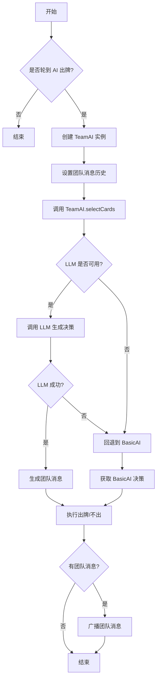
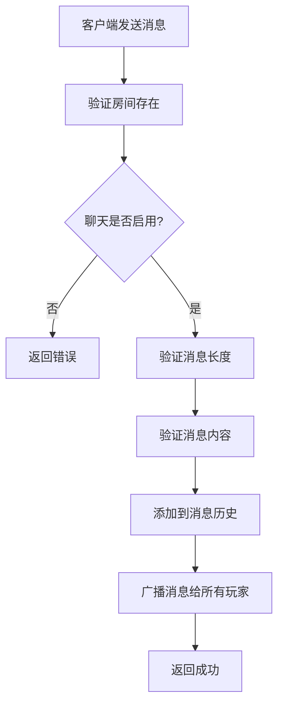
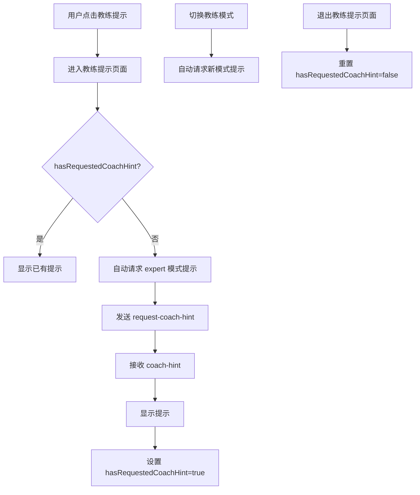

# 掼蛋教练 V2 详细设计方案（LLD）

## 1. 文档范围
本详细设计覆盖 V2 里程碑能力：
- AI 对手优先使用 LLM 出牌
- 团队聊天系统
- 消息融入 AI 决策
- 聊天开关控制
- UI 优化
- 教练提示优化

不包含：
- 复盘回溯（V3）
- 私聊功能

关联文档：
- `guandan/PRD-guandan-coach-v2.md`
- `guandan/HLD-guandan-coach-v2.md`

## 2. 代码改动清单（目标文件）

### 2.1 后端（server）
1. `server/src/socket/index.ts`（扩展）
   - 新增 `TeamMessage` 接口
   - 扩展 `Room` 接口，添加 `teamChatEnabled` 和 `teamMessages`
   - 新增事件处理：`send-team-message`、`toggle-team-chat`
   - 新增响应事件：`team-message`、`team-chat-toggled`
   - 修改 `executeAiPlayTurn()`，使用 `TeamAI`

2. `server/src/ai/team-ai.ts`（新增）
   - `TeamAI` 类实现
   - `selectCards()` 方法：优先 LLM，回退 BasicAI
   - `generateTeamMessage()` 方法：生成团队消息

3. `server/src/coach/reason-engine.ts`（扩展）
   - 新增 `callLLMForMessage()` 方法

### 2.2 前端（client）
1. `client/src/types/index.ts`（扩展）
   - 新增 `TeamMessage` 类型

2. `client/src/stores/game.ts`（扩展）
   - 新增 `teamMessages[]`
   - 新增 `teamChatEnabled`
   - 新增相关方法

3. `client/src/composables/useSocket.ts`（扩展）
   - 发送 `send-team-message`、`toggle-team-chat`
   - 监听 `team-message`、`team-chat-toggled`

4. `client/src/components/Game/TeamChatPanel.vue`（新增）
   - 消息展示列表
   - 消息输入框
   - 发送按钮
   - 聊天开关状态显示

5. `client/src/views/GameView.vue`（扩展）
   - 引入 `TeamChatPanel`
   - 添加 `hasRequestedCoachHint` 状态
   - 添加教练提示自动请求逻辑
   - 移除 `ChatWindow` 组件

6. `client/src/components/Game/HandCards.vue`（优化）
   - 缩小卡牌尺寸
   - 调整样式变量

7. `client/src/components/Game/PlayedCards.vue`（优化）
   - 调整出牌位置
   - 缩小已出牌尺寸

8. `client/src/components/Game/CoachHintPanel.vue`（优化）
   - 默认教练模式改为"expert"
   - 移除"教练提示"按钮
   - 监听模式切换，自动请求提示

## 3. 详细接口设计（Socket）

### 3.1 请求：`send-team-message`
方向：Client → Server

```json
{
  "roomId": "ROOM_001",
  "message": "我能接"
}
```

字段说明：
- `roomId`：当前房间 ID
- `message`：消息内容（最大 50 字）

### 3.2 响应：`team-message`
方向：Server → Client（广播）

```json
{
  "playerId": "ai-1",
  "playerName": "AI 1",
  "position": 1,
  "content": "你先出",
  "timestamp": 1699999999999
}
```

字段说明：
- `playerId`：发送者 ID
- `playerName`：发送者名称
- `position`：发送者位置（0-3）
- `content`：消息内容
- `timestamp`：时间戳

### 3.3 请求：`toggle-team-chat`
方向：Client → Server

```json
{
  "roomId": "ROOM_001",
  "enabled": false
}
```

字段说明：
- `roomId`：当前房间 ID
- `enabled`：是否启用团队聊天

### 3.4 响应：`team-chat-toggled`
方向：Server → Client（广播）

```json
{
  "enabled": false
}
```

字段说明：
- `enabled`：当前团队聊天状态

### 3.5 创建房间扩展
事件：`create-room`（扩展）

新增参数：
```json
{
  "roomId": "ROOM_001",
  "playerName": "玩家1",
  "aiDifficulty": "normal",
  "mode": "local",
  "teamChatEnabled": true
}
```

字段说明：
- `teamChatEnabled`：是否启用团队聊天（默认 true）

## 4. 类设计

### 4.1 TeamAI 类
**文件**：`server/src/ai/team-ai.ts`

**职责**：AI 出牌决策 + 团队消息生成

**属性**：
| 属性 | 类型 | 说明 |
|------|------|------|
| `basicAI` | `BasicAI` | 基础 AI 实例 |
| `reasonEngine` | `ReasonEngine` | 理由引擎 |
| `game` | `GuandanGame` | 游戏实例 |
| `config` | `TeamAIConfig` | 配置 |
| `teamMessages` | `TeamMessage[]` | 团队消息历史 |

**方法**：
| 方法 | 参数 | 返回 | 说明 |
|------|------|------|------|
| `constructor` | `game: GuandanGame, config?: Partial<TeamAIConfig>` | - | 构造函数 |
| `setTeamMessages` | `messages: TeamMessage[]` | `void` | 设置团队消息 |
| `addTeamMessage` | `message: TeamMessage` | `void` | 添加消息 |
| `selectCards` | `cards: Card[], lastPattern: CardPattern \| null, position: number` | `Promise<TeamAIResult>` | 选择出牌 |
| `buildHintInput` | `cards: Card[], lastPattern: CardPattern \| null, position: number` | `BuildCoachHintInput \| null` | 构建提示输入 |
| `generateTeamMessage` | `selectedCards: Card[], handCards: Card[], lastPattern: CardPattern \| null, position: number` | `Promise<string \| undefined>` | 生成团队消息 |

### 4.2 TeamAIConfig 接口
```typescript
interface TeamAIConfig {
  useLLM: boolean          // 是否使用 LLM
  teamChatEnabled: boolean // 是否启用团队聊天
  maxMessageLength: number // 消息最大长度
}
```

### 4.3 TeamAIResult 接口
```typescript
interface TeamAIResult {
  cards: Card[]                          // 选择的牌
  message?: string                       // 团队消息（可选）
  confidence: 'low' | 'medium' | 'high'  // 置信度
  source: 'llm' | 'basic-ai'             // 决策来源
}
```

## 5. 数据库与状态设计

### 5.1 Room 状态扩展
```typescript
interface Room {
  game: GuandanGame
  sockets: Map<string, string>
  aiDifficulty: AIDifficulty
  mode: 'local' | 'online'
  teamChatEnabled: boolean      // 新增：团队聊天开关
  teamMessages: TeamMessage[]   // 新增：消息历史
}
```

### 5.2 TeamMessage 接口
```typescript
interface TeamMessage {
  playerId: string      // 发送者 ID
  playerName: string    // 发送者名称
  position: number      // 发送者位置（0-3）
  content: string       // 消息内容
  timestamp: number     // 时间戳
}
```

## 6. 关键流程设计

### 6.1 AI 出牌流程


### 6.2 团队消息发送流程


### 6.3 教练提示自动请求流程


## 7. UI 组件详细设计

### 7.1 HandCards.vue 优化
**CSS 变量调整**：
| 变量 | 原值 | 新值 | 说明 |
|------|------|------|------|
| `--card-w` | 60px | 46px | 卡牌宽度 |
| `--card-h` | 85px | 66px | 卡牌高度 |
| `--stack-overlap` | 55px | 45px | 重叠宽度 |
| `--font-size-lg` | 1.3rem | 1rem | 大字体 |
| `--font-size-md` | 1rem | 0.85rem | 中字体 |
| `--font-size-sm` | 0.9rem | 0.75rem | 小字体 |

### 7.2 PlayedCards.vue 优化
**位置调整**：
| 位置 | 原样式 | 新样式 |
|------|--------|--------|
| 上方 | top: 80px | top: 65px |
| 左侧 | left: 95px | left: 10px |
| 右侧 | right: 95px | right: 10px |

**卡牌尺寸**：
| 属性 | 原值 | 新值 |
|------|------|------|
| width | 36px | 28px |
| height | 50px | 40px |
| font-size | 14px | 11px |

### 7.3 CoachHintPanel.vue 优化
**默认模式**：`'expert'`（原为 `'novice'`）

**新增逻辑**：
- 监听 `coachMode` 变化，自动触发 `@request` 事件
- 移除"教练提示"按钮

## 8. GameView.vue 新增逻辑

### 8.1 状态变量
```typescript
const hasRequestedCoachHint = ref(false)
```

### 8.2 监听逻辑
```typescript
watch(
  () => [showCoachHint.value, coachShell.value] as const,
  ([newShow, newShell]) => {
    const lock = newShow && newShell === 'coach'
    document.body.style.overflow = lock ? 'hidden' : ''
    
    if (newShow && newShell === 'coach' && !hasRequestedCoachHint.value) {
      hasRequestedCoachHint.value = true
      handleCoachHint('expert')
    }
  },
  { flush: 'post' },
)

watch(showCoachHint, (ok) => {
  if (!ok) {
    coachShell.value = 'hand'
    hasRequestedCoachHint.value = false
  }
})
```

## 9. 错误处理与日志

### 9.1 错误码
| 错误码 | 说明 |
|--------|------|
| `TEAM_CHAT_DISABLED` | 团队聊天已关闭 |
| `MESSAGE_TOO_LONG` | 消息过长 |
| `MESSAGE_INVALID` | 消息内容无效 |

### 9.2 日志记录
- AI 出牌决策来源
- 团队消息发送/接收
- LLM 调用失败
- 教练提示请求

## 10. 安全性考虑

### 10.1 消息内容过滤
- 禁止包含牌面信息
- 禁止包含攻击性语言
- 消息长度限制

### 10.2 权限控制
- 只有房间内玩家可以发送消息
- 只有房间创建者或管理员可以切换聊天开关

## 11. 部署与集成

### 11.1 依赖要求
- Node.js >= 18
- Socket.io >= 4.0
- 现有 LLM 配置

### 11.2 环境变量
无新增环境变量，复用现有配置

## 12. 测试计划

### 12.1 单元测试
- `TeamAI.selectCards()` - LLM 调用和回退逻辑
- `TeamAI.generateTeamMessage()` - 消息生成
- `ReasonEngine.callLLMForMessage()` - LLM 消息调用

### 12.2 集成测试
- 团队消息发送和接收
- 聊天开关切换
- AI 出牌流程
- 教练提示自动请求

### 12.3 功能测试
- AI 使用 LLM 出牌
- AI 自动生成团队消息
- 消息融入 AI 决策
- 手牌尺寸验证
- 出牌位置验证
- 教练提示默认模式验证
- 教练提示自动请求验证
